## 試験を始める前に必ずやること!!
以下の手順に沿って操作を行ってください。
1. VSCodeで、プロジェクト直下にある`.github`フォルダの中の `/workflows/classroom.yml`というファイルを開く
2. 1で開いたファイルの16行目の下に、以下内容を加える(具体的には `uses: actions/checkout@v4`と書かれているところの下です )
   1. ミスしないように必ずコピペで書き換えること

```yml
    - name: setup JDK21
      uses: actions/setup-java@v4
      with:
        distribution: 'temurin'
        java-version: '21'
```

上記の記述を書き加えた後のファイルの内容は以下のようになるので、書き加えた箇所に齟齬がないか（左側の半角スペースの数含めて）重点的に確認する

```yml
name: Autograding Tests
'on':
- push
- workflow_dispatch
- repository_dispatch
permissions:
  checks: write
  actions: read
  contents: read
jobs:
  run-autograding-tests:
    runs-on: ubuntu-latest
    if: github.actor != 'github-classroom[bot]'
    steps:
    - name: Checkout code
      uses: actions/checkout@v4
    - name: setup JDK21 # ここが書き加えた箇所
      uses: actions/setup-java@v4 #ここが書き加えた箇所
      with: #ここが書き加えた箇所
        distribution: 'temurin' #ここが書き加えた箇所
        java-version: '21' #ここが書き加えた箇所
    # 以降の記述はデフォルトのままとすること（ここでは記述が長くなるので省略してますが、皆さんは省略しないでください）
```

3. 書き換えが完了したらこのファイルを閉じる
   1. 以降このファイルは絶対に操作しないこと（何か誤操作があるとソースコードが動かなくなります）

## 問題1.

以下の要件に従って、特定の画面を表示する機能を持つハンドラメソッドを作成してください。

このハンドラメソッドでは、return文で指定された文字列を直接表示するように設定してください。

- ハンドラメソッドは `controller/HomeController` 内に、不足しているアノテーション等の記述を補完して作成してください。
- 画面の表示は `http://localhost:8080/question1` へアクセスして表示するものとします。
- `Welcome to the Schedule Management System` というテキストは **見出し1** とします。
- `Go to Schedule List`というテキストのリンクが、`/question2/index`へ遷移するように設定してください。

### 動作確認

`http://localhost:8080/question1` へアクセスし、以下の画像の通りの表示となることを確認してください。

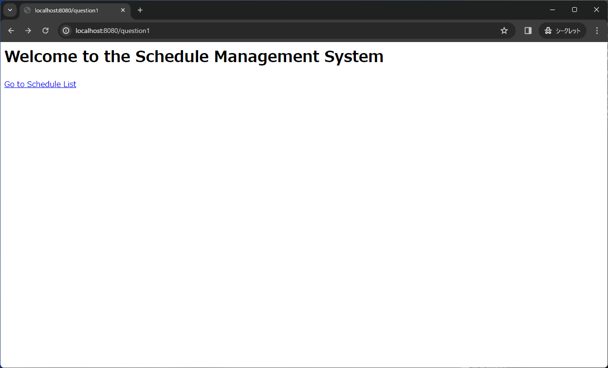


## 問題2.

簡易的なスケジュール管理リストを作成します。

まず、スケジュールの一覧を表示する画面を作成します。

以下のURL/HTTP通信方法でアクセスするとスケジュール一覧画面に遷移します。
|URL|HTTP通信方法|
|---|---|
|`http://localhost:8080/question2/index`|GET|

`resouces/templates` 直下の `index.html` ファイルを使用し、以下の指示に従って必要なクラスとハンドラメソッドを作成してください。

`index.html` を改変してはいけません。

1. 必要なクラスの修正: `com.example.chapter01test（プロジェクト名）` パッケージ内にある`Schedule`クラスを修正してください。
フィールド名や型は、`index.html`を参照して推測し、追加してください。
コンストラクタ、アクセサも追加してください。
2. フィールドの定義:`controller`パッケージ内の`ScheduleController.java` には、すでにフィールドとして `Schedule` インスタンスを格納する空のArrayList `scheduleList` が宣言されています。
この`scheduleList` の初期値に、以下のインスタンスを格納するように修正してください。


    | ID | Name(タスク名) | StartDateTime(開始日時) | Duration(所要時間) | Location(場所) |
    | --- | --- | --- | --- | --- |
    | 1 | Lunch | 2019/01/22 12:00:00 | 1.0 | Shibuya |
    | 2 | Meeting | 2019/01/22 15:00:00 | 3.0 | Shinjuku |
    | 3 | Dinner | 2019/01/22 19:00:00 | 8.0 | Kichijoji |
3. ハンドラメソッドの作成: `ScheduleController.java`にて、必要なハンドラメソッドを定義してください。
必要であれば、適切なアノテーションやその他記述を追加してください。
ビューに渡すデータとして、2.で定義した `scheduleList` を使用してください。

### 動作確認

`http://localhost:8080/question2/index` へアクセスし、以下の画像の通りの出力となることを確認してください。

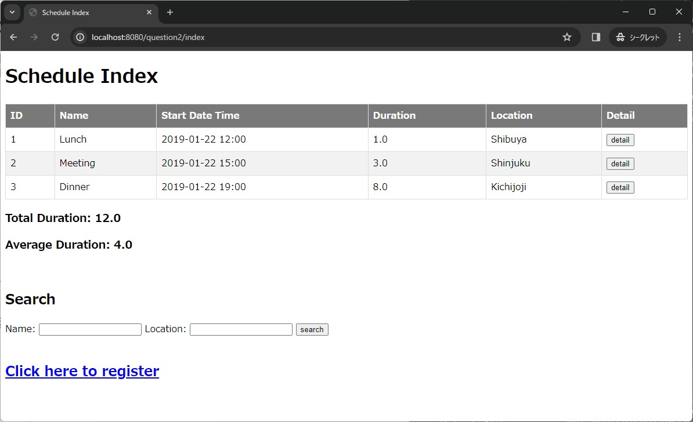


## 問題3.

問題2で作成した一覧画面の **「detail」** ボタンをクリックすると、以下の通信を行いスケジュールの詳細を表示する画面に遷移します。  
|URL|HTTP通信方法|
|---|---|
|`http://localhost:8080/question2/detail/{id}`|GET|
※ URLの`{id}`には、詳細を表示したいスケジュールの**ID**の値が入ります。

`scheduleList` の要素の中から、URLの`{id}`に該当するIDの `Schedule` インスタンスを取得してビューへ渡します。
  
この機能を実装するために、`resouces/templates` 直下の `detail.html` ファイルを使用して、指定された表示に沿ったハンドラメソッドを`ScheduleController.java`に作成してください。

`detail.html` を改変してはいけません。

### 動作確認

ID:1の **「detail」** ボタンを押下し、`http://localhost:8080/question2/detail/1` へアクセスした時に以下の画像の通り、**ID**が**1**のスケジュールの詳細が表示されることを確認してください。

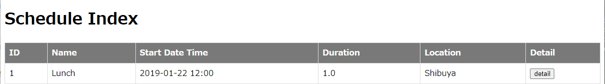

↓

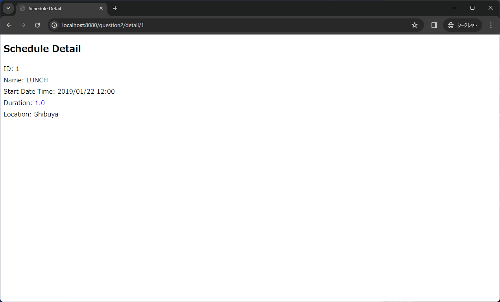


## 問題4.

問題2で作成した一覧画面の中央下部にある **「Search」** フォームを使用すると、以下の通信先に入力フィールドに入力した値がクエリパラメーターとして送信されます。

|URL|HTTP通信方法|
|---|---|
|`http://localhost:8080/question2/search`|GET|

送信されたクエリパラメーターを基に、 `scheduleList` からスケジュールを抽出し、詳細情報を画面に表示します。  
入力フィールドと抽出条件の説明は下表の通りです。  

| 入力フィールド | 説明 |
| --------- | ----------|
| `Name` | - `Schedule` インスタンスの `name` に、入力した文字列を含む (部分一致) <br> - 空白の場合は条件を付与しない |
| `Location` | - `Schedule` インスタンスの `location` に、入力した文字列を含む (部分一致) <br> - 空白の場合は条件を付与しない |

この機能を実装するために、`resouces/templates` 直下の `result.html`ファイルを使用し、指定された表示に従って`ScheduleController.java`内に適切なハンドラメソッドを作成してください。

NameとLocationはそれぞれ入力は**必須ではありません** 。

また、これらのフィールドに**初期値は設定されていません**。

`result.html` を改変してはいけません。

### 動作確認1

以下画像通りに入力フォームに入力後 **「search」** ボタンを押下します。  


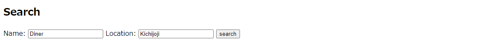

↓  
  
`http://localhost:8080/question2/search?name=Dinner&location=Kichijoji`に遷移され、以下の画像の通り、IDが**3**のスケジュールが表示されることを確認してください。
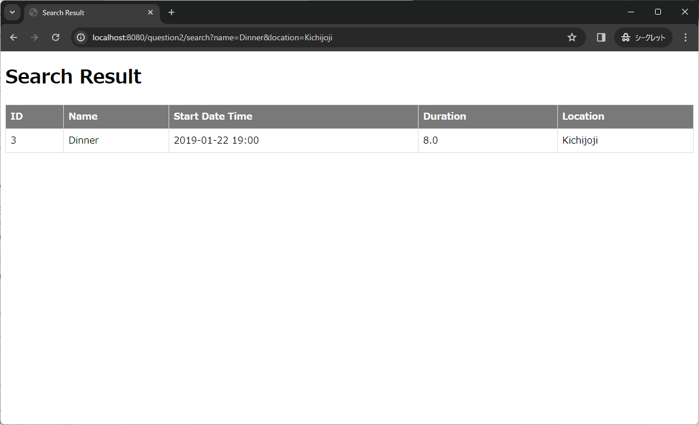


### 動作確認2

ブラウザのアドレスバーに **「`http://localhost:8080/question2/search?name=Lu`」** を直接入力してアクセスを試みると、以下の画像の通りIDが**1**のスケジュールが表示されることを確認してください。
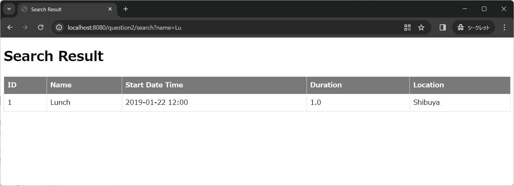


### 動作確認3

ブラウザのアドレスバーに **「`http://localhost:8080/question2/search?location=Shi`」** を直接入力してアクセスを試みると、以下の画像の通りIDが**1**と**2**のスケジュールが表示されることを確認してください。
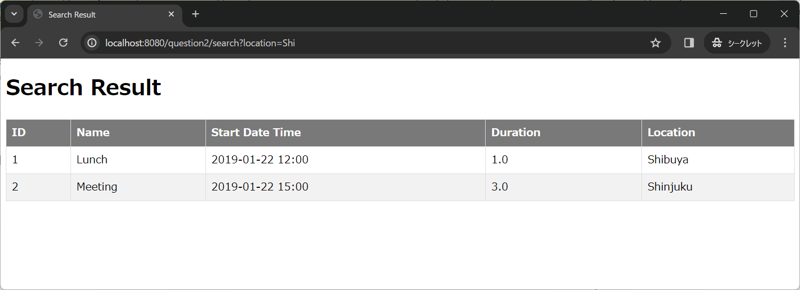


## 問題5.

問題2で作成した一覧画面の最下部にある **「Click here to register」** リンクをクリックすると、以下の通信を行い新規スケジュール登録画面に遷移します。
|URL|HTTP通信方法|
|---|---|
|`http://localhost:8080/question2/register`|GET|


入力フィールドに対応する`ScheduleForm`インスタンスのフィールドは下表の通りです。
| 入力フィールド | インスタンスのフィールド |
|-----|-----|
| ID | id |
| Name | name |
| Start Date time | startDateTime |
| Duration  | duration |
| Location | location |


この機能を実装するために、`resouces/templates` 直下の `register.html`ファイルを使用し、以下の指示に従って必要なDTO(Data Transfer Object)クラスとハンドラメソッドを作成してください。

- 必要なDTOクラスは、`com.example.chapter01test(プロジェクト名).dto` パッケージ内の`ScheduleForm` クラスを修正してください。
- ハンドラメソッドは`ScheduleController.java`に作成してください。

`register.html` を改変してはいけません。

### 動作確認

**「Click here to register」** リンクをクリックし、 `http://localhost:8080/question2/register` へアクセスした時に以下の画像の通りの表示となることを確認してください。

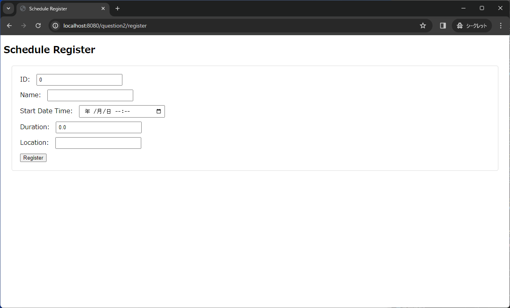


## 問題6.

問題5で作成した登録画面から全ての入力必須項目を入力後 **「Register」** ボタンをクリックすると、以下の通信を行いデータが正常に登録された場合には登録成功画面に遷移します。  
|URL|HTTP通信方法|
|---|---|
|`http://localhost:8080/question2/add`|POST|


データ登録時、受け取った`ScheduleForm`インスタンスのフィールドは、`Schedule`インスタンスの同名のフィールドにマッピングされます。  
その後、マッピングされた `Schedule`インスタンスは `scheduleList` に追加されます。

また登録成功画面には、 `scheduleList` に追加された`Schedule`インスタンスの詳細が表示されます。

この挙動を実装するために、`resouces/templates` 直下の `success.html`ファイルを用いて、以下の指示に沿ったハンドラメソッドを作成してください。

- ハンドラメソッドは `ScheduleController.java`に実装してください。
- 今回の実装では、IDを含む全ての項目の重複登録を許可します。
- また、今回はバリデーションの実装は必要ありません。

`success.html` を改変してはいけません。

### 動作確認

新規スケジュール登録画面にて下表の通り入力後 **「Register」** ボタンをクリックすると、`http://localhost:8080/question2/add`へアクセスし以下の画像の通りの表示となることを確認してください。
| 入力フィールド | 値 |
|--------------|---|
| ID | 4 |
| Name | Study |
| Start Date time |2019/01/23 10:00|
| Duration | 6 |
| Location | Akasaka |

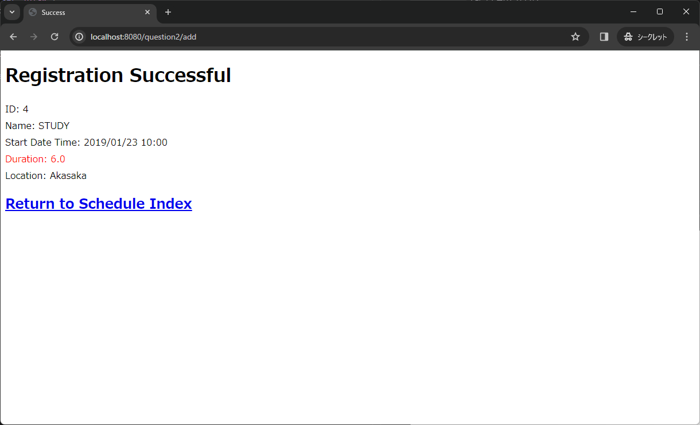

また登録成功後、画面下部にあるリンクから一覧画面に戻り、以下の画像の通り登録したスケジュールがテーブルに正常に追加されていることを確認してください。

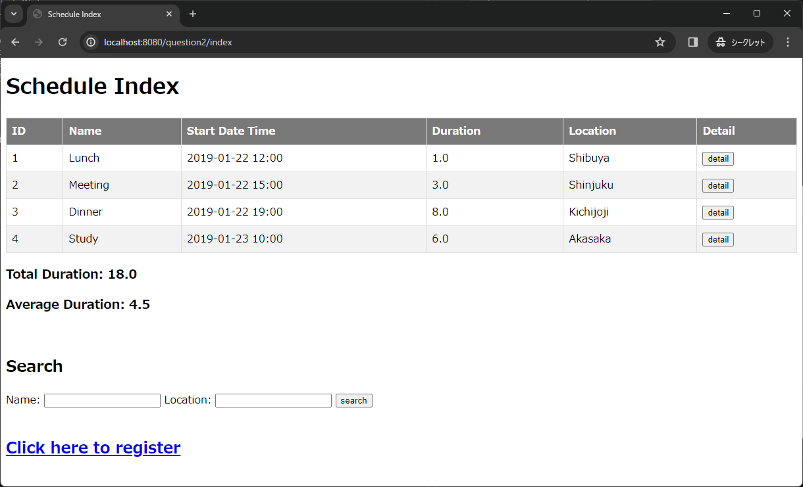

